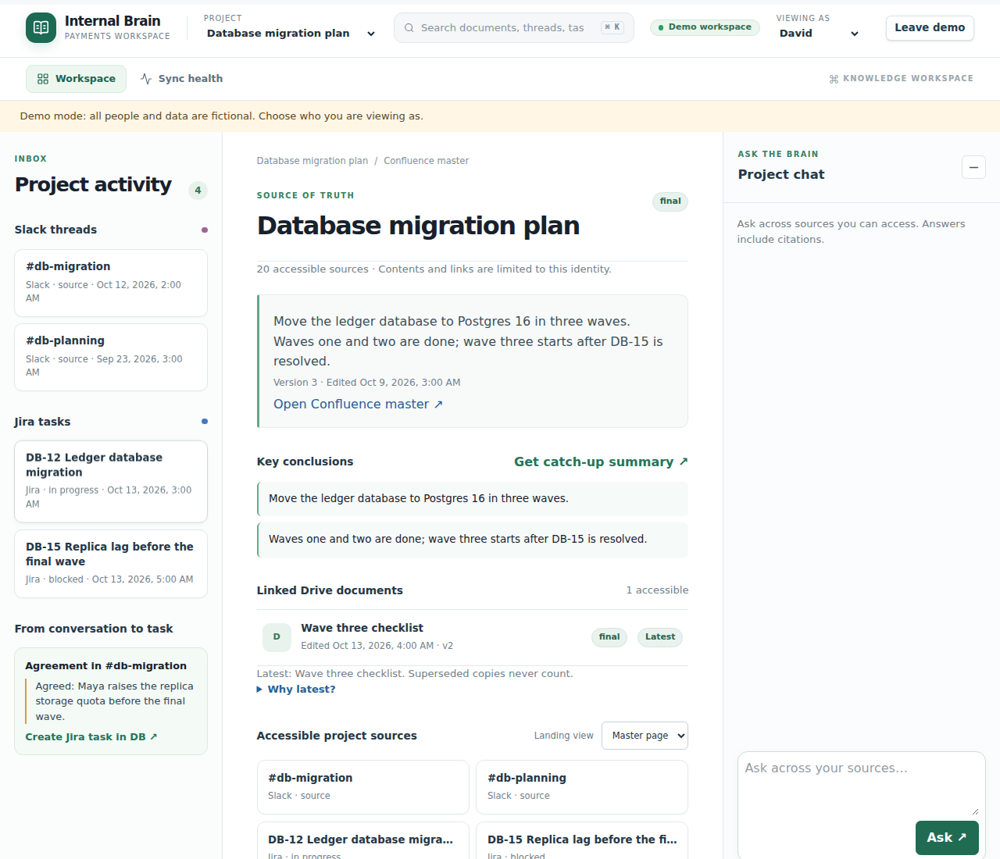
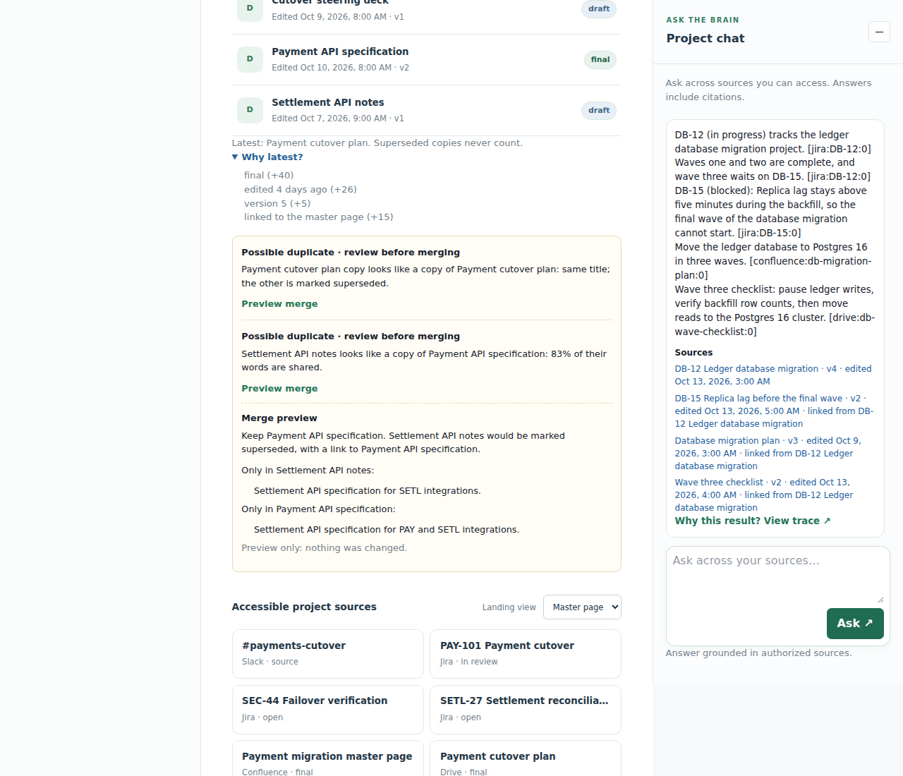

> **Start here.** [Architecture](docs/architecture.md) shows how the challenge brief's requirements are met, and the [worked examples](docs/worked-examples.md) run its five scenarios. Sign-in uses the Auth0 Next.js SDK: see [Auth0 setup, checklist and troubleshooting](apps/web/AUTH0.md). The website offers SSO, plus a public demo with fictional people and data when `DEMO_API_URL` is set. `pnpm dev` runs the demo API, which accepts `x-demo-user` persona headers for curl and the website's demo; `pnpm dev:sso` runs the SSO API from the root `.env.local`. The hosted setup, a Vercel site and one Tencent Cloud server, is in [infra/tencent/README.md](infra/tencent/README.md). Every project decision is in [decisions.md](decisions.md).

# Internal Brain

A permission-aware knowledge workspace over Slack, Jira, Confluence, and Drive data. Local fixtures are the default; opt-in live connectors read configured items from all four providers. It runs as a pnpm TypeScript workspace with a Node API and a Next.js web host. Vite builds the existing workspace UI served by that host. The web header and navigation use React with shadcn components; the workspace views still use the existing JavaScript controller. The default search is an in memory sparse term vector, keyword, and freshness index. Optional embeddings from Cloudflare Workers AI (`bge-m3`) add semantic vectors, and optional Supabase uses pgvector and Postgres full text search. A remote FGA adapter can also be selected with environment variables; the default path uses in process grants.

## Run

Use Node with `pnpm` 9.15.0.

```sh
pnpm install
pnpm typecheck
pnpm test
```

**Website (SSO).** Copy `.env.example` to `.env.local` at the repository root and fill it in; see [Auth0 setup](apps/web/AUTH0.md). Then, in two terminals:

```sh
pnpm dev:sso               # API at http://127.0.0.1:3000 in Auth0 mode, reads .env.local
pnpm --dir apps/web dev    # web host at http://127.0.0.1:3001
```

Open `http://127.0.0.1:3001`. The web host forwards API requests server-side with the signed-in user's Auth0 token. If sign-in fails, run `pnpm doctor:sso` while both servers are running. It checks your settings, the Auth0 tenant, the Supabase directory and the running services, and prints the fix for each problem. It changes nothing and prints no secrets.

**Website demo (no sign-in).** Run the demo API and point the web host at it:

```sh
pnpm dev                                                      # demo API at http://127.0.0.1:3000
DEMO_API_URL=http://127.0.0.1:3000 pnpm --dir apps/web dev    # web host at http://127.0.0.1:3001
```

Open `http://127.0.0.1:3001` and choose **Try the demo**. The workspace shows a demo banner. **Viewing as** in the header switches between the six fictional people, and **Leave demo** ends the demo. To offer SSO and the demo together, start the demo API on another port (`PORT=3002 pnpm dev`) next to `pnpm dev:sso`, and set `DEMO_API_URL=http://127.0.0.1:3002` in `.env.local`. A signed-in session always takes priority over demo mode.

**API only (demo headers).** `pnpm dev` starts the API at `http://127.0.0.1:3000` with demo header authentication enabled and loads no env file. Use it with curl as shown below, or as the website's demo API. `pnpm exec tsx data/seed.ts` prints fixture counts; it does not seed a database. `GET /health` reports local sync cursors, pending runs, and audit counts.

For a direct query without the web app:

```sh
curl -s http://127.0.0.1:3000/v1/query \
  -H 'content-type: application/json' -H 'x-demo-user: ravi' \
  -d '{"question":"What does PAY-101 need before cutover?"}'
```

## Demo users and scenarios

| User | Role | Useful scenario |
| --- | --- | --- |
| Ravi (`ravi`) | Head of payments (member), payments/security/fraud groups | Ask about PAY-101, SEC-44, and the cutover plan; Maya can remove his Slack channel membership to show a live access change on the next query. |
| Maya (`maya`) | Admin | Edit mock source content, narrow a tier, revoke brain grants, remove a group or native Slack channel member, run sync, and preview access. |
| Alex (`alex`) | Intern | Try a security or restricted incident query; the fixed no-result reply conceals inaccessible results. Catch up on the open steering deck and chargeback guide. |
| David (`david`) | Member, payments/security; the engineer in the brief's scenarios | Ask about the database migration and its Slack blockers; he isn't in the private #db-oncall channel, so it never reaches his answers. Compare with Ravi's view. Turn the #db-migration agreement into a Jira task, then mark it done. |
| Nur (`nur`) | Compliance | Inspect and search audit events, seal a batch, inspect and verify a proof, view traces, and export CSV. |
| Wei Ming (`wei`) | Contractor | Access explicitly shared vendor integration material; payment/security material remains denied. |

The challenge brief's scenarios run on the mock data as written:

| # | Who and what | What happens |
| --- | --- | --- |
| 1 | David: "What's the status of the database migration project and were there any blockers raised in Slack last week?" | Slack comes first, limited to the last week; Jira issues count at any date and show their status ("DB-15 (blocked)"). The answer cites #db-migration, DB-12, DB-15 and the plan page. The private #db-oncall blocker appears only for its members, such as Ravi. |
| 2 | Maya appends a step to the payment-service incident runbook; David asks "What's the latest runbook for the payment-service incident?" | The next answer quotes every step, including the new one, and cites version 4 with its edit time. The superseded 2025 copy is never cited. An edit made at the source is picked up the same way, before any sync. |
| 3 | Wei or Alex: "Show me the security incident report from the Q3 breach" | The fixed no-result reply, identical to a question about something that doesn't exist. |
| 4 | Maya removes David from #db-migration, or restricts the runbook page | His next answer drops that channel or page; his own trace doesn't name it. |
| 5 | Nur: "Show me everything user 'ravi' accessed related to the 'payment-gateway' Confluence space in the last 30 days" | The audit search reads the user, space and dates, and returns those questions with their answers and access decisions. |

**[Worked examples](docs/worked-examples.md)** walk through all five with the real answers, citations, access decisions, audit entries and screenshots. `pnpm scenarios` regenerates that page, and `pnpm test` fails when it no longer matches what the code does. `pnpm scenarios:model` runs the same steps with the configured language model and writes `docs/worked-examples-model.md`; its calls count against the usage meter.

A question that names a platform (Slack, Jira, Confluence, Drive) gets that platform first. A time it names ("last week", "past 3 days", "yesterday") limits that platform, or every platform when none is named. Other platforms with a clearly relevant match take turns, so one answer can cite all four. The most relevant source is quoted in full, and the next three add their best sentence. Mock dates move forward with the clock, so "last week" keeps finding the demo data.

In the default demo, changes made through admin routes or workspace actions alter only the running mock process and reset on restart. Content edits increment a source version and sync immediately. A permission edit changes grants without rebuilding chunks. Sync also compares source IDs and tombstones deleted fixtures. Search finds candidate IDs before permission checks; the API checks selected documents against the source before building answer context and again after generation, before returning it. A revoked item causes a fixed no-result response on that query. In live mode, change source permissions and content at the provider.

With an embedding provider (Cloudflare Workers AI's `bge-m3`, D56), sync embeds changed document chunks and a query embeds its question. A refused or failed embedding never stops sync: that document keeps keyword search, the provider rests for five minutes, and a later sync embeds it. Questions asked meanwhile use keywords. With `SUPABASE_URL` and `SUPABASE_SECRET_KEY` as well, sync writes documents and changed chunks to Supabase and queries its `hybrid_search` RPC. The RPC returns candidate document and chunk IDs and scores; local and optional remote authorization plus live mock source checks still run before content enters an answer. Query embedding or Supabase search failures fall back to the local index. Supabase **sync write** failures fail that sync run for retry; initial sync runs in the background. Supabase configuration enables durable index/grant snapshots, cursors, checkpoints, connections and import jobs.

## Choosing what a company includes

Connecting a source imports **nothing** until an admin chooses. On the Connectors page, each source offers:

- **Include everything**, **Include only what I select** (a checklist of Slack channels, Jira projects, Confluence spaces or shared drives, loaded from the connected account) or **Include nothing**.
- **Only content that is new or changed from now on**, which fixes a starting moment when it is saved and keeps it on later saves, or **history since** a chosen date.

Saving starts the import. Narrowing, or choosing nothing, removes what is no longer included, with its grants and index entries. Each change is audited as `scope_changed`. "From now on" goes by the source's modified time, so an older item edited later is included. Selecting from My Drive uses file IDs; the checklist lists shared drives. The scope is part of the existing saved state and needs no migration.

## Workspace

What each person sees beside the chat is built only from what they may open: their projects, links, files and
suggestions.

- **Projects:** choose one in the header. Its Confluence master page, threads, tasks and files follow. A project is
  listed only to people who can open its master page.
- **Links:** a document lists the linked items the person may also open. Answers bring in a ticket's linked thread,
  page and files, and say what linked them ("linked from DB-12").
- **From conversation to task:** an agreement such as "Agreed: …" in a thread becomes a suggested Jira task.
  - In the demo, David creates DB-16 from the #db-migration agreement, then marks it done from the task.
  - With live sources, the card links to Jira instead, because the app only reads them.
- **Latest and duplicates:** "Why latest?" lists the reason for every point, and a likely duplicate gets a merge
  preview that changes nothing.
- **Catch-up:** chosen by role and groups.
  - Alex, an intern, gets an onboarding overview, and Wei what is shared with him.
  - Team members get a project's status, blockers and decisions, from that project only.
  - Nur gets the last 7 days of the audit trail.





## Language model (optional, free only)

Without a model, the built-in writer answers: it quotes the most relevant source in full and the best sentence of the next three. A model can only choose and order sentences better. Every answer, from either, keeps only lines copied word for word from the sources the asker may see, each with its citation.

The project pays for no model use (`decisions.md`, D27, D28 and D55):

- **Provider:** Groq, on both APIs (D54, D55): `LLM_PROVIDER=groq`, `LLM_MODEL=openai/gpt-oss-120b` and
  `LLM_MAX_TOKENS=4000`. Groq's free plan has no card on file, so it can never bill. On 2 Oct, 8 of 9 measured answers
  were grounded at about 870 tokens each. Groq has retired `llama-3.3-70b-versatile`; its console lists the current
  models.
  - **Tencent's models aren't used** (D55). TokenHub stopped the free trial's inference services while the account
    balance was insufficient, and calls failed with code `401006`. The client keeps its `tokenhub` and `hunyuan`
    presets as tested options. They only start with a usage file and token budgets below the free tokens, and Tencent
    bills only if post-paid billing is turned on.
- **Its instructions** ([`llm.ts`](apps/api/src/llm.ts)) tell the model to:
  - copy sentences exactly, one per line, each with its citation;
  - answer every part of the question, using every passage that helps and leaving out unrelated ones;
  - keep status labels such as "DB-15 (blocked):" and every step of a procedure;
  - put the direct answer first, in at most eight sentences.

  Any line that isn't copied exactly is dropped afterwards, so the model can only choose and order sentences.
  Lookalike characters, such as a non-breaking hyphen, curly quotes or special spaces, don't count as differences,
  and the answer shows the source's own text.
- **Usage meter:** `LLM_USAGE_FILE` keeps the token and answer counts across restarts. At `LLM_TOKEN_BUDGET` or `LLM_DAILY_ANSWERS`, the built-in writer answers instead. If the model is rate limited, failing or takes over 60 seconds, or no line of its reply is copied word for word, it does the same, and the audit records an `llm_fallback` event with the reason. If the usage file can't be read or written, no model is called.
  - Calls still running count against the limits, so questions asked at the same moment can't all get past them.
  - A call that gives no usable answer still counts what the provider may bill. A refused request counts nothing.
- **One Groq account:** its free plan limits requests and tokens per minute and per day, and every key in the account
  shares those limits: both APIs, and any laptop. Each API's `LLM_DAILY_ANSWERS` caps its share.
- **Semantic search** (optional): Cloudflare Workers AI's `bge-m3` (D56), with `EMBEDDING_PROVIDER=cloudflare`,
  `EMBEDDING_API_KEY` and `CLOUDFLARE_ACCOUNT_ID`. In the Cloudflare dashboard, open **Workers AI**, choose **Use REST
  API**, create a Workers AI API token, and copy the account ID shown there.
  - **Free:** the Workers Free plan includes 10,000 neurons a day, about 9 million tokens for this model, and refuses
    calls past that instead of billing. Keep the account on that plan; on Workers Paid, use past the allocation is
    billed.
  - **What it sees:** the text of every chunk, restricted documents included, and each question. Cloudflare says it
    doesn't use customer content to train models.
  - **Limits:** at `EMBEDDING_TOKEN_BUDGET`, if set, semantic search pauses and keyword search carries on.
- **`pnpm llm:usage`** asks ten typical questions through the configured model and prints the tokens each call used,
  and why any call gave no usable answer. For Groq, whose free plan can't bill, it reports the tokens and points to
  Groq's daily limits. For the unused Tencent presets, it projects 350 answers against their free tokens instead. Its
  calls count against the meter.
- **`pnpm llm:calibrate`** embeds the mock documents and labelled questions, then suggests a value for `SEMANTIC_MIN`
  from the scores. On 3 Oct it set 0.51 against Cloudflare's `bge-m3`; the earlier 0.35 let in 176 of 234 unrelated
  pairs. Run it again when the documents change, because the right value depends on them.

Both scripts read `.env.local`. The hosted APIs take their model settings as described in [infra/tencent/README.md](infra/tencent/README.md).

## API routes

All `/v1` routes require either a valid bearer token configured as below or, in demo mode (`pnpm dev` locally, or `PUBLIC_DEMO=true`), `x-demo-user`. The website uses the official Auth0 Next.js SDK with server-managed sessions. Set the Regular Web Application credentials in `.env.local`; Supabase holds the server-only user directory. Browser API requests go through `/api/brain/*`, which attaches the SDK access token server-side. Demo visitors' requests carry only the chosen persona and go only to `DEMO_API_URL`. `GET /health` does not require identity. See [Auth0 sign-in and live sources](docs/live-sources-and-sign-in.md) for setup.

| Route | Purpose |
| --- | --- |
| `POST /v1/query` with `{ "question": "..." }` | Cited answer and `traceId`, or fixed no-result reply. |
| `GET /v1/me` | Validated fixture identity and role for the signed-in web UI. |
| `GET /v1/workspace` | Currently visible mock documents after indexed and live checks. |
| `GET /v1/trace?traceId=...` | Query actor's own trace or a compliance user's trace. |
| `POST /v1/admin/content` with `{ "docId": "...", "content": "..." }` | Admin mock source edit and sync. |
| `POST /v1/admin/permissions` with `{ "docId": "...", "permissions": { ... } }` | Admin narrowing of mock source permissions and sync. |
| `GET /v1/admin/permissions?docId=...` | Admin loads an accessible document's full source permissions for the web JSON editor. |
| `POST /v1/admin/tier` with `{ "docId": "...", "tier": "restricted" }` | Admin tier narrowing. |
| `POST /v1/admin/group` with `{ "userId": "ravi", "group": "fraud-ops" }` | Admin removal of a fixture user from a group. |
| `POST /v1/admin/channel-member` with `{ "userId": "ravi", "docId": "slack:fraud-private" }` | Admin removal of a mock Slack native member and sync. |
| `POST /v1/admin/sync` | Admin manual sync. |
| `GET /v1/admin/preview?user=alex` | Admin visible-document preview with access reasons. |
| `GET /v1/audit` | Compliance events, batches, and chain status. |
| `GET /v1/audit/search` | Compliance query and filters: `q`, `user`, `source`, `space`, `from`, `to`. |
| `GET /v1/admin/connections`, `GET /v1/admin/import-jobs` | Admin connector status and progress. |
| `POST /v1/admin/onboard` | Background full mock Company A import. |
| `POST /v1/admin/connections/:source/authorize`, `GET .../callback` | Start OAuth and complete its single-use callback. |
| `PUT /v1/admin/connections/:source/scope`, `POST .../import`, `DELETE /v1/admin/connections/:source` | Scope, reimport, disconnect and purge. |
| `POST /v1/audit/seal` | Compliance Merkle seal of unsealed events. |
| `GET /v1/audit/proof?sequence=1` | Compliance proof for a sealed event. |
| `POST /v1/audit/verify` with `{ "sequence": 1 }` | Compliance chain, batch, and proof verification. |

## Environment

| Variable | Use |
| --- | --- |
| `ALLOW_DEMO_AUTH=true` | Allows `x-demo-user` outside `NODE_ENV=production`; the root `pnpm dev` script sets it. |
| `PUBLIC_DEMO=true` | Runs the public demo API: it accepts `x-demo-user` even with `NODE_ENV=production` and serves only the mock corpus. Startup fails if any Auth0, Supabase, live-source, source-OAuth or remote FGA setting is present. See [hosting](infra/tencent/README.md). |
| `DEMO_API_URL` (web host) | The demo API's origin. When set, the start page offers **Try the demo**, and demo visitors' workspace requests go there with only the chosen persona. |
| `AUTH0_ISSUER`, `AUTH0_AUDIENCE`, `AUTH0_ORG_ID` | Auth0 SSO with cached JWKS, active directory lookup and organization validation. Requires Supabase directory/persistence and an audit signing key. See [setup](docs/live-sources-and-sign-in.md). |
| `LLM_PROVIDER`, `LLM_API_KEY`, `LLM_MODEL` | Optional language model: `groq` (D55); without them, the built-in writer answers. The `tokenhub` and `hunyuan` presets, and the older `HUNYUAN_API_KEY` and `HUNYUAN_MODEL`, still work but aren't used. A key or model alone causes startup configuration failure. `LLM_BASE_URL` sends the same API to another HTTPS address, or to plain HTTP on this machine for a local stub. `LLM_MAX_TOKENS` caps each answer (default 1500; reasoning models such as gpt-oss need about 4000). See [Language model](#language-model-optional-free-only). |
| `LLM_USAGE_FILE`, `LLM_TOKEN_BUDGET`, `LLM_DAILY_ANSWERS` | The usage meter: counts kept across restarts, a total token budget and model answers per UTC day. At either limit, the built-in writer answers. Optional for Groq; the unused Tencent presets need the file and the budget to start. |
| `EMBEDDING_PROVIDER`, `EMBEDDING_API_KEY`, `CLOUDFLARE_ACCOUNT_ID`, `EMBEDDING_TOKEN_BUDGET` | Optional semantic search: `cloudflare`, Workers AI's `bge-m3` (D56), with an API token and the 32-character account ID. It embeds changed chunks and questions as 1024-dimensional vectors. The budget is optional on Cloudflare's free plan; the unused `hunyuan` preset (or the older `HUNYUAN_EMBEDDING_API_KEY`) needs it and `LLM_USAGE_FILE`. With no Supabase variables, semantic ranking runs in the local index. At the budget, semantic search pauses and keyword search carries on. |
| `SUPABASE_URL`, `SUPABASE_SECRET_KEY` | Server-only directory, audit and state persistence. With embeddings, also enables pgvector search. Apply migrations 001–005. |
| `LIVE_SOURCES_JSON` | Selects real HTTP readers for configured Slack channels, Jira issues, Confluence pages, and Google Drive files. All four source entries, provider credentials, and Auth0 sign-in are required. See [setup and limits](docs/live-sources-and-sign-in.md). |
| `AUDIT_LOG_PATH`, `AUDIT_SIGNING_KEY_FILE` | Together select a flushed JSONL audit file and load a PEM private signing key for Merkle batches. With neither, audit data and roots are in memory. Setting a log path without a key fails startup. |
| `WEB_ORIGIN` | API `Access-Control-Allow-Origin` value; defaults to `http://127.0.0.1:3001`. CORS allows the demo and Authorization headers. Set server-side web `BRAIN_API_URL` separately. |
| `FGA_API_URL`, `FGA_STORE_ID`, `FGA_MODEL_ID`, `FGA_CLIENT_ID`, `FGA_CLIENT_SECRET`, `FGA_API_TOKEN_ISSUER`, `FGA_API_AUDIENCE` | OpenFGA SDK client credentials; install the model before enabling. |
| `SOURCE_OAUTH_JSON`, `API_ORIGIN` | OAuth app configuration and API callback origin. Tokens use Supabase Vault. |
| `HOST`, `PORT` | API bind address and port; default loopback port 3000. |

## Deployment status and remaining audit items

Without Supabase, the demo keeps everything in memory and resets on restart. The hosted setup is described in [infra/tencent/README.md](infra/tencent/README.md): the Vercel site offers the public demo and optional SSO, backed by two APIs on one Tencent Cloud Lighthouse server. Live identity, provider OAuth, Supabase Vault, pgvector and OpenFGA require externally provisioned services. No live credentials were used in verification. Run one API writer per organization; see [setup and current limits](docs/live-sources-and-sign-in.md).

The compliance audit contains question and answer text and source identifiers, so keep audit access and signing keys restricted. The remaining limits, such as the write-once anchor for Merkle roots that isn't running yet, webhooks and source-specific remote FGA types, are listed under [Architecture: Limits](docs/architecture.md#limits). CodeBuddy/WorkBuddy evidence must be captured by someone using those products; none is fabricated.

## Documentation

- [Architecture](docs/architecture.md): how the brief's requirements are met, and the pipeline with the five points that matter most.
- [Trust boundaries](docs/trust-boundary.md): hosting, sign-in, and what crosses each boundary.
- [Worked examples](docs/worked-examples.md): the brief's five scenarios, run end to end on the demo data.
- [Decisions](decisions.md): every choice, the options considered and the trade-offs.
- Setup: [Auth0 sign-in](apps/web/AUTH0.md), [live sources and persistence](docs/live-sources-and-sign-in.md), and [hosting on Tencent Cloud](infra/tencent/README.md).
- Diagrams: the sources are in [docs/diagrams](docs/diagrams), with rendered images in [docs/images](docs/images). `pnpm test` checks that each diagram in the docs matches its source and that every link in the docs resolves.

History, kept as a record:

- [Five-stage plan](docs/internal-brain-five-stage-plan.md) (26 Sep 2026): the original design.
- [Repository audit](docs/broppy-audit-batch0.1.md) (30 Sep 2026) and its [implementation notes](docs/audit-batch0.1-implementation.md).
