# Internal Brain architecture

This describes the integrated code in this repository. The default runnable path is a local mock. Auth0, remote FGA, Hunyuan chat and embeddings, Supabase retrieval, and signed file audit are optional paths. None of the external services is provisioned by this repository, and no real credentials or browser interaction were exercised. The [Better T Stack site](https://www.better-t-stack.dev/) informed only the TypeScript monorepo outline, not the runtime framework choices.

## Project outline

| Path | Current responsibility |
| --- | --- |
| `apps/web` | Static HTML, CSS, and JavaScript served by Python on port 3001; blank auth config uses the demo identity header, while a complete config enables Auth0 PKCE login. |
| `apps/api` | Node HTTP API on loopback port 3000; owns sync, queries, admin actions, and audit routes. |
| `packages/connectors` | Mutable Slack, Jira, Confluence, and Drive mock connectors, including source permission checks. |
| `packages/retrieval` | In memory sparse and optional semantic chunk index, optional Supabase document/chunk writer and hybrid search client, deterministic local answer client, and citation checker. |
| `packages/fga-adapter` | In process document permission and tier checks, plus an optional HTTP `RemoteFgaAdapter` selected by the FGA environment variables listed in the README. |
| `packages/audit`, `packages/types` | Hash chained events, Merkle batches, optional signed file store, and shared types. |
| `data/mock`, `data/seed.ts` | Source and user fixtures; the seed script reports fixture counts. |
| `infra/fga/model.fga`, `infra/supabase/migrations` | Model for optional remote FGA and SQL migration for the optional Supabase pgvector/full text path. Startup does not install the FGA model or apply the SQL migration. |

## Running architecture

Solid paths below run with `pnpm dev`. Dotted paths show optional code paths or blueprints. The standalone [Mermaid source](diagram-source.mmd) contains this diagram.

```mermaid
flowchart LR
  Browser[Browser] --> Web[Static web :3001]
  Web -->|demo x-demo-user| API[Node API :3000]
  Web -.->|optional PKCE and bearer token| Auth0[Auth0 authorization and JWKS]
  Web -.->|optional bearer API calls| API
  Auth0 -.->|API validates JWT| API
  subgraph Local[API process: local mock]
    API --> Sync[Startup and 30 s sync]
    Sources[Four mock source connectors] -->|changed IDs and ID pass| Sync
    Sync -->|missing ID| Tombstone[Tombstone; clear chunks and grant]
    Sync -->|content/title change| Index[In memory chunks and sparse vectors]
    Sync -->|permission change| Grants[In process FGA style grants and tier]
    Sync -->|metadata change| Index
    Tombstone --> Index
    API --> Search[Local vector + keyword + freshness search]
    Index --> Search
    Search -->|candidate document and chunk IDs| Check[Batch document ID check]
    Grants --> Check
    Check -->|allowed IDs| Live[Live mock source access and document refresh]
    Sources --> Live
    Live -->|current authorized chunks| Context[Context assembly]
    Live -->|new version / permission| Index
    Live -->|new permission| Grants
    Check -->|none allowed| Fixed[Fixed no-result response]
    Live -->|none usable| Fixed
    Context --> LLM[LLMClient: deterministic local answer]
    LLM --> Checker[Extractive citation output checker]
    Checker --> API
    API --> Audit[Hash chain and Merkle batches]
    Audit --> Console[Compliance API and web console]
    Admin[Mock admin web view] -->|content / native permission edit, membership removal, tier narrowing| API
  end
  Context -.->|optional question + authorized chunk text and IDs| Hunyuan[Hunyuan chat API]
  Hunyuan -.-> Checker
  Sync -.->|optional changed chunk text| Embed[Hunyuan embeddings API]
  API -.->|optional question| Embed
  Embed -.->|1024-d vectors| Index
  Sync -.->|optional documents and changed chunks| DB[Supabase pgvector and FTS]
  API -.->|optional hybrid_search query| DB
  DB -.->|candidate IDs and scores| Check
  API -.-> File[Optional local JSONL audit file + signing key]
  Sync -.->|optional tuple reconciliation| Model[Remote FGA API and model]
  Check -.->|optional batch ID check intersected with local decision| Model
  Live -.->|optional recheck after refresh| Model
  Migration[SQL migration applied separately] -.-> DB
```

## Data and permission paths

At startup the API syncs all four mock sources. Every 30 seconds the orchestrator repeats sync and seals any unsealed audit events. Each source keeps an in memory cursor and pending ID checkpoint; a failed run resumes from its pending IDs while the process remains alive. Sync compares the connector's current ID list with indexed IDs, tombstones missing documents, removes their chunks and grants, and records a deletion event. This ID pass does not persist checkpoints across restarts.

`HybridIndex.upsert` hashes content, permissions, and metadata separately. A content or title change rebuilds chunks and sparse term vectors. With `HUNYUAN_EMBEDDING_API_KEY`, sync also refreshes 1024-dimensional semantic vectors for those chunks. A permission only change updates indexed permission facts and in process grants without rebuilding or re-embedding chunks. Metadata is updated in the indexed document; version and timestamp changes alone do not rebuild chunks. Local search combines vector cosine similarity, keyword matches, and freshness at weights 0.65, 0.25, and 0.10. It uses semantic vectors when available for a chunk and a valid embedded question, otherwise sparse term vectors.

With `SUPABASE_URL`, `SUPABASE_SECRET_KEY`, and the embedding key, sync upserts document metadata and permissions, and rewrites chunks only for content/title changes or first persistence in this API process. The SQL migration defines `vector(1024)` chunk embeddings, generated `tsvector` fields, and an active-document `hybrid_search` RPC using the same score weights. Deleted documents are tombstoned and excluded by the RPC. The RPC returns only document IDs, chunk IDs, and scores; the API retains the local index for context and authorization. Its `connector_state`, `sync_runs`, and audit tables are schema only: the running API does not persist cursors, checkpoints, or audit there. Query embedding or Supabase search failure falls back to local search. Embedding refresh or Supabase writes that fail during sync fail the run for retry; startup sync failure prevents the server from starting. The migration must be applied separately and has not been exercised against a real Supabase service.

For a query, the API hashes the question for its audit entry, embeds it when configured, and searches the local index. With Supabase configured and a valid question vector, the Supabase RPC supplies candidates; RPC failure falls back to local results. The API then checks unique candidate **document IDs** through the in process FGA style adapter. Its decision combines copied source permission facts, native source rules, and a tier policy; contractors are denied by default. If configured, the remote FGA adapter also reconciles document grants during sync and batch checks candidate IDs. An allowed query document must pass both local and remote decisions. Remote errors deny; an unreachable remote service can fail startup sync. The tier can only be narrowed by admin action. A selected allowed candidate gets a live mock source access and version/permission check before context assembly. If those facts changed, the local index and grants refresh; local and optional remote access are checked again. A newly changed chunk ID with no matching selected candidate is skipped, so that query can return fewer chunks. Denied candidate content, title, and metadata are not passed to the LLM client. If no usable context remains, the API returns the same fixed no-result message and skips generation.

The default `LlmClient` emits deterministic cited excerpts. When both `HUNYUAN_API_KEY` and `HUNYUAN_MODEL` are configured, the API instead sends the question and selected authorized chunk text with citation IDs to Hunyuan. Its response passes through `groundedOutput`: a line is kept only if it has recognized citation markers, at most one sentence under the checker's splitting rule, and claim text appearing in a cited authorized chunk. This extractive check rejects paraphrases and fabricated cited sentences; it does **not** establish that the source itself is true. Citations returned to the browser include title, URL, source version, edit time, and index time.

The mock admin can edit source content, narrow source permission fixtures or a tier, remove a fixture user from a group or Slack channel, trigger sync, and preview another fixture user's access. The web admin view loads a selected accessible document's full native permissions through `GET /v1/admin/permissions`, offers a JSON editor with source-specific narrowing checks, and submits through `POST /v1/admin/permissions`. It calls the group and channel actions at `POST /v1/admin/group` and `POST /v1/admin/channel-member`. Content and permission edits trigger sync immediately; group removal updates an in memory user, and connector change events are local callbacks rather than real platform webhooks. The workspace API checks indexed permission and live mock access before returning full visible document content. The web app also offers a source overview, task suggestions, latest file scoring, a duplicate suggestion, and an intern catch-up query. Alex can cite the open steering deck without gaining access to security material. These are local UI behaviors based on accessible fixture documents. `GET /health` exposes cursors, pending runs, and audit counts; `GET /v1/trace` exposes per-query events to their actor and to the compliance role. An actor's no-result trace is reduced to a generic answer event; compliance can inspect the full internal trace.

With blank `apps/web/auth-config.json`, the static UI uses the demo user switcher and `x-demo-user`. A complete issuer, client ID, and audience enables Auth0 Authorization Code + PKCE: the browser validates login state and signed ID token, stores the access token in `sessionStorage`, sends Bearer calls, and uses `/v1/me` for the fixture role. The API validates access-token signature, issuer, audience, and expiry and maps `sub` to a fixture user. The API's CORS origin is configurable, while the static UI's API URL remains fixed at `127.0.0.1:3000`. A partial or invalid web configuration shows an error. No Auth0 tenant or browser flow was exercised; see [web sign-in setup](../apps/web/AUTH0.md).

Audit entries form a hash chain. The orchestrator or compliance route seals Merkle batches, and `GET /v1/audit/search` and `POST /v1/audit/verify` expose token matching and proof verification alongside listing and proof routes; the browser exports loaded events as CSV. The default store is process memory. With `AUDIT_LOG_PATH` and `AUDIT_SIGNING_KEY_FILE`, entries and signed batches are flushed to a local JSONL file and verified on load. There is no external append-only root store; a writer with access to both the file and signing key can rewrite history. See [trust boundaries](trust-boundary.md).

Audit batch 0.1 adds the Auth0 directory, Supabase audit/state RPCs, background imports, and a plain Connectors page. See [implementation notes](audit-batch0.1-implementation.md) and [deployment setup](live-sources-and-sign-in.md).
