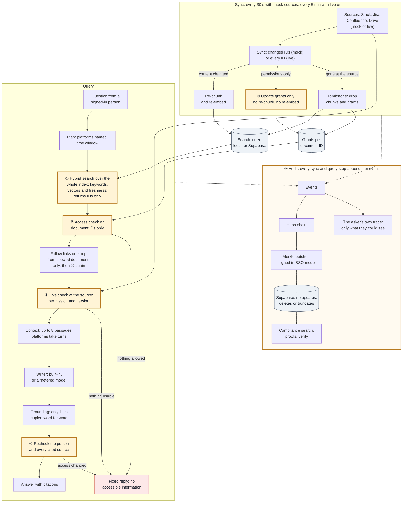

# Architecture

Internal Brain answers questions across Slack, Jira, Confluence and Drive, using only what the person asking may see
in each platform, and records every decision in an audit trail that can't be quietly changed. This page explains how
the challenge brief's requirements are met, then walks through the pipeline. [Trust boundaries](trust-boundary.md)
covers hosting and sign-in, and [worked examples](worked-examples.md) shows each scenario running.

## What runs where

| Part | Code | Role |
| --- | --- | --- |
| Web host | [`apps/web`](../apps/web/AUTH0.md): Next.js 16 on Vercel | Sign-in through the Auth0 SDK, the public demo, the `/api/brain` proxy and the workspace pages. |
| API | `apps/api`: Node; `sso-api` and `demo-api` on Tencent Cloud Lighthouse, or `pnpm dev` and `pnpm dev:sso` locally | Sync, questions, admin actions and the audit routes. |
| Connectors | `packages/connectors` | Mock fixtures and live Slack, Jira, Confluence and Drive clients, with each platform's own permission rules. |
| Retrieval | `packages/retrieval` | The hybrid index, the built-in writer, the grounding check and the Supabase search client. |
| Access | `packages/fga-adapter` | Grants and tiers per document ID, and the optional remote OpenFGA check. |
| Audit | `packages/audit` | The hash chain, Merkle batches, signatures and proofs. |
| Data | Supabase ([migrations](../infra/supabase/migrations/004_durable_state.sql)) | The directory, state, audit rows, chunks and Vault tokens. |

## How the brief is met

| Requirement | How | Proof |
| --- | --- | --- |
| **Heterogeneous sources, without flattening permissions** | Each document keeps its platform's own permission shape: Slack channel members, Jira project and issue viewers, Confluence space and page viewers, Drive owner and shared users. [`nativeAllows`](../packages/connectors/src/index.ts) applies that shape on top of brain grants and the tier. Contractors see only what is shared with them by name. | [Connector tests](../packages/connectors/src/index.test.ts): "applies native permission changes without changing content and reports changes". [FGA tests](../packages/fga-adapter/src/remote.test.ts): "denies when native source or local tier denies, even if remote allows". [Scenario 4](worked-examples.md#scenario-4-access-changes-apply-to-the-next-question). |
| **Permission-aware retrieval** | Search returns IDs only, and access is decided on document IDs before any text is read (① ②). Each document is checked again at its source before its text enters the context (④). When nothing is allowed, every asker gets the same fixed reply. | [Brain tests](../apps/api/src/brain.test.ts): "never sends denied titles or private channel names to the LLM", "applies a live permission revocation on the next query". [Scenario 3](worked-examples.md#scenario-3-no-hint-that-restricted-content-exists). |
| **Context across platforms** | The [query plan](../apps/api/src/query-plan.ts) reads the platforms and time window a question names. Links the sources make themselves (Jira issue links and attachments, Confluence page links, and issue keys and links in text) bring in a ticket's linked thread, page and files, one hop from the documents the asker may open. Platforms with a clearly relevant match take turns, Jira passages state the issue status, and the context holds up to 8 passages. | [Scenario tests](../apps/api/src/scenarios.test.ts): scenario 1, and "Context assembly: linked items", such as "never follows links from a document the asker may not open". [Query plan tests](../apps/api/src/query-plan.test.ts). [Scenario 1](worked-examples.md#scenario-1-one-question-across-platforms). |
| **Audit trail: tamper-evident, complete, queryable** | Every step of sync and of each question appends an event to a hash chain (⑤). Merkle batches are sealed on every sync and signed in SSO mode, and Supabase rejects updates and deletes. Compliance search reads plain-English questions and answers "who retrieved this document". | Brain tests: "produces a verifiable Merkle inclusion proof". [Audit tests](../packages/audit/src/index.test.ts). [Scenario 5](worked-examples.md#scenario-5-the-audit-trail-answers-compliance-questions), including the tamper checks. |
| **LLM safety** | A writer sees only the question and passages the asker may see, freshly checked. Every answer line must be copied word for word from a passage it cites. A model runs behind a usage meter, and the built-in writer takes over when it can't answer. | Brain tests: "removes uncited output" and the "When the language model can't answer" suite. [Usage meter tests](../apps/api/src/llm-budget.test.ts). |

Freshness, the brief's scenario 2, comes from the same live check: a document whose version changed at the source is
refreshed before it is used ([scenario 2](worked-examples.md#scenario-2-fresh-content)).

## The pipeline

The five points the [five-stage plan](internal-brain-five-stage-plan.md) asked to make "visually unavoidable" are
numbered ① to ⑤. The rendered image is [docs/images/diagram-pipeline.png](images/diagram-pipeline.png).

<!-- diagram: docs/diagrams/pipeline.mmd -->

| | Point | In the code | Test |
| --- | --- | --- | --- |
| ① | **Hybrid search happens before authorization.** Search ranks the whole index by keywords, vectors and freshness, and returns document and chunk IDs. The Supabase `hybrid_search` RPC returns IDs and scores only. | `HybridIndex.search` in [`retrieval`](../packages/retrieval/src/index.ts); `Brain.query` in [`brain.ts`](../apps/api/src/brain.ts) | "finds an authorized result beyond thirty higher ranked denied hits"; "persists semantic chunks, searches IDs through Supabase, and leaves embeddings alone on permission edits" |
| ② | **Authorization sees document IDs only, not content.** `FgaAdapter.batchCheck(user, docIds)` decides each candidate. With remote FGA set, both must allow. | [`fga-adapter`](../packages/fga-adapter/src/index.ts) | "never sends denied titles or private channel names to the LLM"; "chunks unique document checks at 50 and maps out of order results by correlation ID" |
| ③ | **Permission updates don't trigger re-embedding.** The index hashes content, permissions and metadata separately, so a permission change updates grants only. | `HybridIndex.upsert`; `Brain.persistSearch` | "does not re-embed permission-only changes"; "keeps cached vectors on permission updates and invalidates them on content, title, and deletion" |
| ④ | **A live check at the source protects against stale access.** Before its text is used, each document's permission and version are checked at the source and refreshed if they changed. After writing, the person and every cited source are checked again. | `Brain.liveAuthorizedDocument`, `Brain.refreshLive` | "applies a live permission revocation on the next query"; "refreshes a newer source version before context assembly"; "rechecks the signed-in user's groups before returning generated text" |
| ⑤ | **Audit and Merkle are a pipeline of their own.** Sync and every query step append events; batches are sealed, signed and stored where they can't be changed. | [`audit`](../packages/audit/src/index.ts); [migration 004](../infra/supabase/migrations/004_durable_state.sql) | "produces a verifiable Merkle inclusion proof"; scenario 5 |

## Sync and freshness

- **Schedule:** the API syncs all four platforms at startup, then every 30 seconds with mock sources and every 5
  minutes with live ones. Each run also seals new audit events into a Merkle batch and saves the state.
- **Changes:** a run reads the IDs a mock source reports as changed, or every ID of a live source, plus any indexed
  ID the source no longer lists.
  - A content or title change re-chunks the document, and re-embeds it when embeddings are on.
  - A permission-only change updates grants.
  - An ID that is gone at the source becomes a tombstone: its chunks, grants and remote tuples are removed.
- **Imports:** they checkpoint after each item and resume after a failure. Connections, import jobs and cursors are
  saved with the state.
- **Freshness between runs:** the live check in each question refreshes a document whose version changed, so an edit
  made at the source shows up in the next answer, before the next sync.

## The query path

1. **Plan:** the question's platform names and time window shape the search ("Slack last week").
2. **Search:** the local index ranks every chunk. With Supabase and embeddings set, the `hybrid_search` RPC can
   reorder chunks that also pass the local relevance check.
3. **Access check on IDs:** local grants, native rules and the tier decide each candidate document. Contractors are
   denied unless a document is shared with them by name, and remote FGA must agree when it is set. With nothing
   allowed, the API returns the fixed reply.
4. **Follow links:** links are followed one hop, in either direction, from the allowed documents that clearly match
   (at least half the best of them, up to eight).
   - A denied document's links are never followed, so nothing hidden can steer an answer.
   - A linked item scores half the item it came through, keeps to the question's time window and passes the same
     access check.
   - It never takes the places of a platform the question named, nor makes a platform count as clearly relevant.
5. **Choose passages:** superseded documents are set aside unless the question asks for history ("old",
   "previous"). Platforms with a clearly relevant match take turns.
6. **Live check:** each passage's document is checked at the source once before its text is used, up to 8 passages.
   A linked item counts only while the item it came through passes too.
7. **Write and ground:** the writer answers from those passages, and only lines copied word for word, each with its
   citation, are kept.
8. **Recheck:** the person and every cited document are checked again. Any change returns the fixed reply.
9. **Answer:** citations carry the title, link, version, edit time and index time, and the item a link came through.
   Answers also say which platforms and dates were searched, and which project they kept to.

The fixed reply, "No accessible information was found for this query.", is the same for a denied document and for
one that doesn't exist. The asker's own trace of such a question is a single event.

## The workspace

Everything the workspace shows is built in [`workspace.ts`](../apps/api/src/workspace.ts) from the documents the
person may open, and nothing else, so nothing hidden can show up. Each document lists only the linked items the
person may also open.

- **Projects:** a Confluence page labelled "master" defines a project. A project holds:
  - what the page links to;
  - the issues, pages and channels tagged with its key;
  - the files and threads those issues link to.

  It is listed only to people who can open its master page.
- **Latest:** each project's latest Drive file, with the reason for every point: status, a recent edit, the version,
  and a link from the master page. Superseded files never count.
- **Duplicates:** files with the same title where one is superseded, or sharing at least 60% of their words. The
  merge is a preview that changes nothing.
- **From conversation to task:** sentences such as "Agreed: …" or "Decision: …" in a thread become a suggested Jira
  task in the thread's project.
  - Creating it and marking a task done work on mock sources only.
  - The task's text comes from the agreed sentence alone. It links back to the thread and copies the permissions of
    the issue it is modelled on.
  - With live sources the app stays read-only and links to the project in Jira.
- **Catch-up** (`/v1/catch-up`): chosen by role and groups, and asked like any question.
  - Interns get what a new hire should read first.
  - People in no group see what is shared with them.
  - Everyone else gets a project's status, blockers and recent decisions, kept to that project's items.
  - Compliance gets the last 7 days of the audit trail instead.

## Writers

- **The built-in writer** ([`LocalGroundedLlm`](../packages/retrieval/src/index.ts)) is code, not a model.
  - It quotes the most relevant source in full (up to six sentences), then the best sentence of the next three.
  - It needs no key or network, and it is the default.
- **A language model** is optional: TokenHub, Hunyuan on Tencent's China site, or Groq.
  - [`llm.ts`](../apps/api/src/llm.ts) is one client for all three.
  - [`llm-budget.ts`](../apps/api/src/llm-budget.ts) puts it behind a usage meter: a token budget, a daily
    allowance, room held for calls still running, and a 60-second timeout.
  - A model receives the question and the authorized passages with their citation IDs, and nothing else.
- **Fallbacks:** the built-in writer answers when the model is over a limit, rate limited or failing, or when none of
  its lines are copied word for word. The audit records `llm_fallback` with the reason. See decisions D27 to D31.

## Audit

- **Events:** every step appends one, from the question, plan and candidates through each access decision, the
  passages sent, any fallback and the answer.
- **Hash chain:** each entry includes the hash of the one before it, computed over a canonical form of its data.
- **Merkle batches:** sealed on every sync, and on demand from the Compliance view. Each batch links to the previous
  root.
- **Signatures:** a stored audit, in Supabase or in an `AUDIT_LOG_PATH` file, signs every batch with Ed25519, and the
  API won't start without `AUDIT_SIGNING_KEY_FILE`. The public demo keeps its audit in memory, unsigned.
- **Storage:** Supabase receives entries and batches in order, and triggers reject updates, deletes and truncates.
  At startup the API verifies the chain, every batch root and every signature.
- **Compliance:** `/v1/audit/search` reads plain-English questions (person, platform, space, dates, document), and
  `/v1/audit/proof` and `/v1/audit/verify` check a Merkle proof. The Compliance view exports CSV.
- **The asker's view:** `/v1/trace` shows the asker only the documents they were allowed.

## Persistence and organizations

- **One organization per API:** each process serves one Auth0 organization (`AUTH0_ORG_ID`) and refuses tokens from
  any other. Directory reads, saved state, audit rows and remote tuples are all scoped to it.
- **One writer per organization:** two APIs writing one organization's audit chain break each other.
- **Saved state:** the index, grants, mock edits, connections, jobs and cursors are saved to Supabase after every sync
  and every successful request. Semantic vectors are restored with the index.
- **Without Supabase:** as in the public demo, everything lives in memory and resets on restart.

## Limits

- **No webhooks:** freshness comes from polling plus the live check in each question.
- **Anchoring isn't running:** `tools/anchor` can copy the signed roots of a file-based audit log into a separate
  repository and check the log against them, but that repository isn't set up, and roots kept in Supabase aren't read
  yet. Until then, someone holding both the database and the signing key could rewrite history undetected.
- **Remote FGA:** it uses a generic per-document schema. Each platform's own permission shape is enforced in the
  connector layer.
- **Embeddings:** semantic search uses Hunyuan's China-site embedding API. Embeddings through TokenHub are
  unconfirmed.
- **Demo identities:** they are fixtures chosen with a header, and only the public demo API accepts them.
- **Live imports:** they read current text only: no revision history, Jira comments or text from images.
- **Workspace writes:** creating a task and Mark done change mock sources only. Live connectors keep read-only scopes.
- **Links by path:** a link is recognised by its path, whatever the host. A link to another company's Jira issue with
  the same key would point at ours, though that item still passes every access check.
- **Saved demo data:** an API that saves its state to Supabase keeps the mock data it first saved, with its dates.
  Newer demo data, such as links, appears only once that saved state is reset.

## More

- [Trust boundaries](trust-boundary.md): hosting, sign-in and what crosses each boundary.
- [Worked examples](worked-examples.md): the five scenarios, with real output.
- [Decisions](../decisions.md): every choice and its trade-offs.
- Setup: [Auth0 sign-in](../apps/web/AUTH0.md), [live sources and persistence](live-sources-and-sign-in.md) and
  [hosting](../infra/tencent/README.md).
