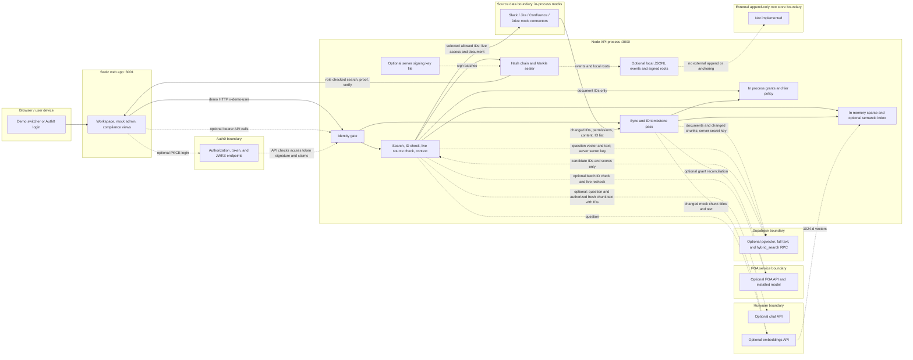

# Trust boundaries

This diagram separates the default local mock from optional external services. Solid arrows run in the default demo; dotted arrows need configuration and existing services. Real Slack, Jira, Confluence, Drive, and an external append-only root store are **not** connected. Supabase, Auth0, Hunyuan, and remote FGA have optional code paths, but no real credentials or browser interaction were exercised.

## Boundary rules and limits

| Boundary | Implemented behavior | Limit |
| --- | --- | --- |
| Browser → web → API | Blank `apps/web/auth-config.json` uses the switcher and `x-demo-user`. API accepts that header only with `ALLOW_DEMO_AUTH=true` outside `NODE_ENV=production`. A complete public config uses browser Authorization Code + PKCE, validates login state and the signed ID token, stores the access token in `sessionStorage`, sends Bearer calls, and gets the UI role from `/v1/me`. CORS allows the demo and Authorization headers. | The switcher is a caller-controlled fixture identity, not login. Partial or invalid web config shows an error. Browser login was not exercised with a real tenant; the web API URL is fixed to `127.0.0.1:3000`. |
| Bearer client → API → Auth0 | With issuer and audience configured, API validates an RS256 access JWT against Auth0 JWKS, issuer, audience, expiry, optional not-before, and a fixture `auth0Sub`. | The API still maps subjects to local fixture users. An external Auth0 tenant and real token were not exercised. |
| API → source platforms | Four mock connectors hold documents and native permission fixtures in process. Selected query documents get live mock access and document refresh before context; workspace documents get the same access path. | No source OAuth, real webhooks, or network platform checks. Admin changes mutate mock fixtures. Group removal changes an in memory user; Slack channel removal narrows a mock native member list. |
| API → FGA | Local `FgaAdapter.batchCheck` checks candidate document IDs against copied permissions and tier. If any of `FGA_API_URL`, `FGA_STORE_ID`, `FGA_MODEL_ID`, or `FGA_API_TOKEN` is set, the API constructs `RemoteFgaAdapter`; sync reconciles document grants and query decisions intersect local and remote checks. Selected items are checked again after live source refresh. | URL, store ID, and model ID are all required in remote mode; token is optional. Partial configuration fails startup. The remote service and model must already exist; local startup does not provision them. Remote failures deny checks or fail sync. |
| API → local index / Supabase | Local sparse vectors, keyword matching, and freshness rank candidates by default. With `HUNYUAN_EMBEDDING_API_KEY`, local search can use semantic vectors. With both Supabase variables and that embedding key, sync writes document metadata and changed 1024-dimensional chunks; the `hybrid_search` RPC ranks pgvector, full text, and freshness and returns candidate IDs and scores. Query embedding or RPC failure falls back to the local index. Missing source IDs become tombstones; permission only sync avoids chunk regeneration and re-embedding. | Local index, grants, cursors, and retry checkpoints remain in memory. The SQL migration must be applied separately; its connector and audit tables are unused. Sync embedding or Supabase write failures fail a sync run, including startup sync. No real Supabase service was exercised. The secret key remains on the API server. |
| API → Hunyuan embeddings | With the embedding key, sync sends changed chunk text and titles, and queries send question text, to the Hunyuan embedding API. The returned 1024-dimensional vectors stay in the local index and optionally go to Supabase. | This sends mock source text to an external service when configured. No real Hunyuan credentials were exercised. |
| API → Hunyuan chat | Optional `LlmClient` sends the question and selected authorized chunk text with citation IDs after local FGA and live checks. Default client is deterministic and local. | The checker requires a cited sentence to appear in an authorized chunk. It rejects paraphrases and cannot establish that the source itself is true. A configured Hunyuan call sends document text to that external service. |
| Admin UI → native permission fixtures | Admin loads the full permissions of a selected accessible document and edits JSON with source-specific narrowing checks; the API independently enforces narrowing and syncs the mock connector. | This changes fixture permissions in the running process, not real source ACLs. |
| API → signing key / audit store | Default audit is an in memory hash chain with Merkle batches. Optional `AUDIT_LOG_PATH` plus `AUDIT_SIGNING_KEY_FILE` flushes entries and signed batches to local JSONL; startup checks chain, roots, and signatures. | The key is read from a server file. The local file is not an independently controlled append-only root store. Verification against a root in the same writable file does not detect a full rewrite by an actor holding the signing key. |
| Compliance UI → audit | Nur's role can list and filter events, seal, inspect proof paths, verify, and export loaded rows to CSV. A query actor can read its own trace; compliance can read traced events. | Search is token matching over audit event fields, not general natural-language reasoning. Audit entries use question hashes and often document hashes, but some event types record raw document IDs, so the audit feed itself is sensitive. |

An absent, denied, or deleted query with no usable context returns `No accessible information was found for this query.` and skips generation. The API does not send denied candidate titles, metadata, or content to Hunyuan chat. Query text is sent to Hunyuan embeddings when that path is configured; sync sends changed mock source text for indexing. Internal audit records counts and access decisions. A query actor's no-result trace is reduced to a generic answer event, while compliance can inspect the full trace. The API's audit and health surfaces are local demo facilities, not evidence of a production trust boundary.
