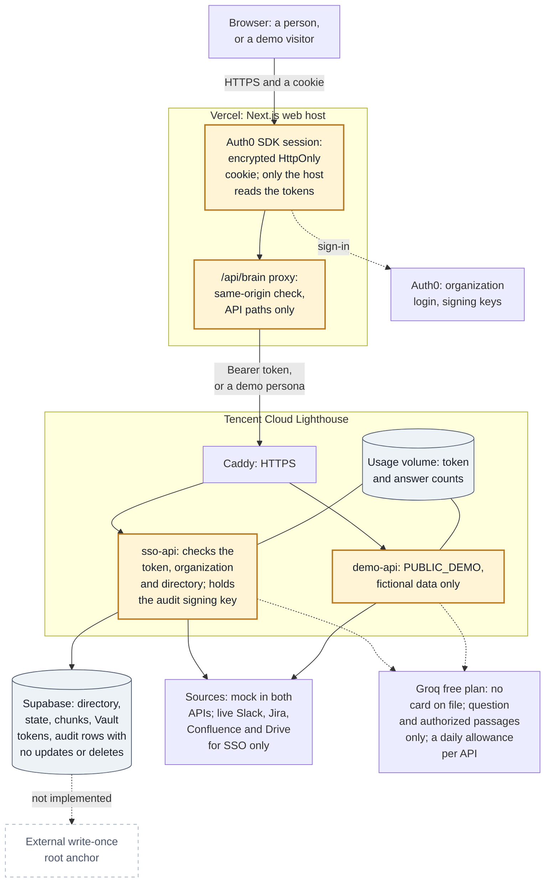
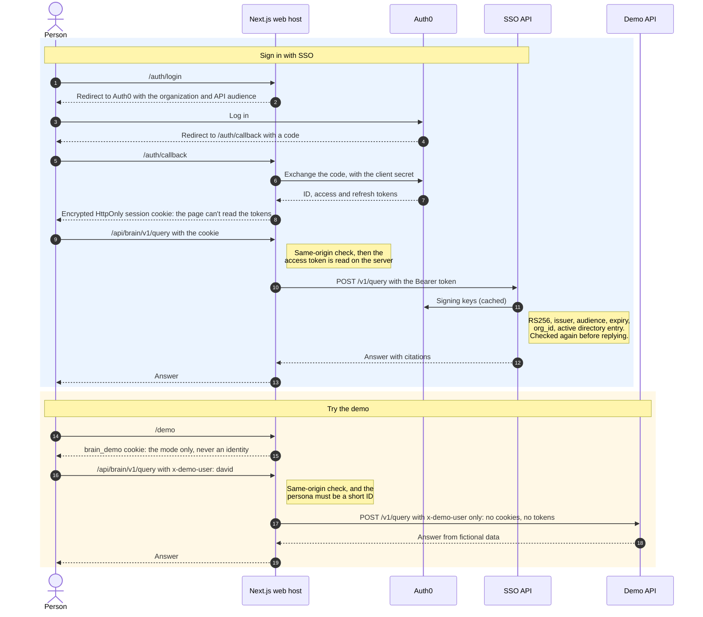

# Trust boundaries

Where each part runs, what crosses between them, and what never does. The hosted setup follows
[infra/tencent/README.md](../infra/tencent/README.md). Locally, the same processes run on `127.0.0.1`:
`pnpm dev` (the demo, with personas chosen by a header) and `pnpm dev:sso` (Auth0 and Supabase). The query pipeline
itself is in [Architecture](architecture.md).

## Hosting

Rendered image: [docs/images/diagram-deployment.png](images/diagram-deployment.png).

<!-- diagram: docs/diagrams/deployment.mmd -->

## Sign-in and the demo

Rendered image: [docs/images/diagram-sign-in.png](images/diagram-sign-in.png).

<!-- diagram: docs/diagrams/sign-in.mmd -->

## What crosses each boundary

| Boundary | What crosses | What never crosses | Limits |
| --- | --- | --- | --- |
| **Browser ↔ web host** | HTTPS requests. The Auth0 SDK's session cookie (encrypted, HttpOnly, SameSite=Lax). In demo mode, the `brain_demo` cookie, which selects the mode only, and the chosen persona's ID. | Tokens the page can read: the SDK's access-token endpoint is off, and only the host can decrypt the session. API addresses and keys. | A demo visitor picks any fictional persona; that is the point of the demo. |
| **Web host ↔ Auth0** | The sign-in redirect, with the organization and API audience. The code exchange, made by the server with the client secret. | The client secret, outside the host's server environment. | Tenant settings are checked by `pnpm doctor:sso`, not by the sandbox. |
| **Web host ↔ SSO API** | `/v1` requests carrying the Bearer access token, after a same-origin check. Bodies are capped at 100 kB, and calls time out after 60 seconds. | The session cookie. Paths outside `/v1` and `/health`. A rejected token's details: every API 401 becomes one generic "did not accept your account" message. A link, project, file or suggestion naming an item the person can't open: the workspace is built only from what they may open. | The host trusts `BRAIN_API_URL`; HTTPS comes from Caddy. |
| **Web host ↔ demo API** | `/v1` requests with `x-demo-user` only: a short lowercase ID, sent only to `DEMO_API_URL`. | Cookies and tokens. Demo traffic never reaches the SSO API, and a signed-in session always wins over the demo cookie. | The demo API trusts the header by design. It serves fictional data only. |
| **SSO API ↔ Auth0** | Signing keys (JWKS), cached. Tokens must be RS256 and match the issuer, audience and expiry, carry `sub`, `exp` and the expected `org_id`, and map to an active directory entry in that organization. | Anything about the question or answer. | The person is checked again before an answer is returned, so a deactivated account stops at once. |
| **API ↔ Supabase** | The server-only secret key. Directory reads, the state snapshot, ordered audit appends, the `hybrid_search` RPC (which returns IDs and scores), and Vault calls for source tokens. | The secret key, outside the API host. Source tokens in API responses or snapshots. | Triggers reject audit updates and deletes, but not a database owner replacing the database. One audit writer per organization. |
| **API ↔ sources** | Mock connectors run inside the API. Live connectors use OAuth tokens kept in Vault (or `LIVE_SOURCES_JSON`); each person needs their own delegated credential, and no credential means no access. | Content from one organization to another: each API serves one organization. | Polling only, no webhooks. Live imports read current text only. Workspace actions (creating a task, Mark done) change mock sources only; live connectors keep read-only scopes, so the app links to Jira instead. |
| **API ↔ model provider** | The question, and the authorized, freshly checked passages with their citation IDs, to Groq, from both APIs, each within its own daily allowance (D55). | Denied documents' titles, metadata or text. Identities, tokens or keys. | The provider sees the passages it is sent. Groq's free plan has no card on file, so it can't bill; both APIs share its limits. |
| **API ↔ embeddings** (optional) | None since Tencent's were dropped (D55). With a provider: changed chunk text at sync, restricted documents included, and question text at query. | Permission data. | The provider sees the text of every chunk, not only what one person may read. |
| **API ↔ remote FGA** (optional) | Organization-scoped tuples at sync; batch checks of document IDs at query. | Document content. | Remote failures deny. Platform permission shapes stay in the connector layer. |
| **Lighthouse host** | Caddy terminates HTTPS for two host names. `sso-api` reads `sso.env` and the audit signing key (mounted read-only). Both APIs share the usage-count volume. | Real settings in `demo-api`: it refuses to start with any Auth0, Supabase, live-source, source OAuth or remote FGA setting. | `docker compose down -v` deletes the usage counts. |
| **Audit store and keys** | Ed25519-signed Merkle batches that link each root to the previous one. At startup, the chain, roots and signatures are checked. | The signing key, outside the API host. | No external write-once anchor is running yet (`tools/anchor` covers file-based logs, not Supabase): someone holding both the database and the key could rewrite history. |
| **Compliance view ↔ audit** | For the compliance role: listing, plain-English search, proofs, verification and CSV export. Anyone else sees only their own trace, which never names what they couldn't see. | Audit data, to other roles. | The audit holds questions, answers and document IDs, so access to it must stay narrow. |

A question with nothing the asker may see gets the fixed reply, "No accessible information was found for this
query.", and no writer is called. Denied documents' titles, metadata and text never reach a writer, a model or the
asker's own trace.
