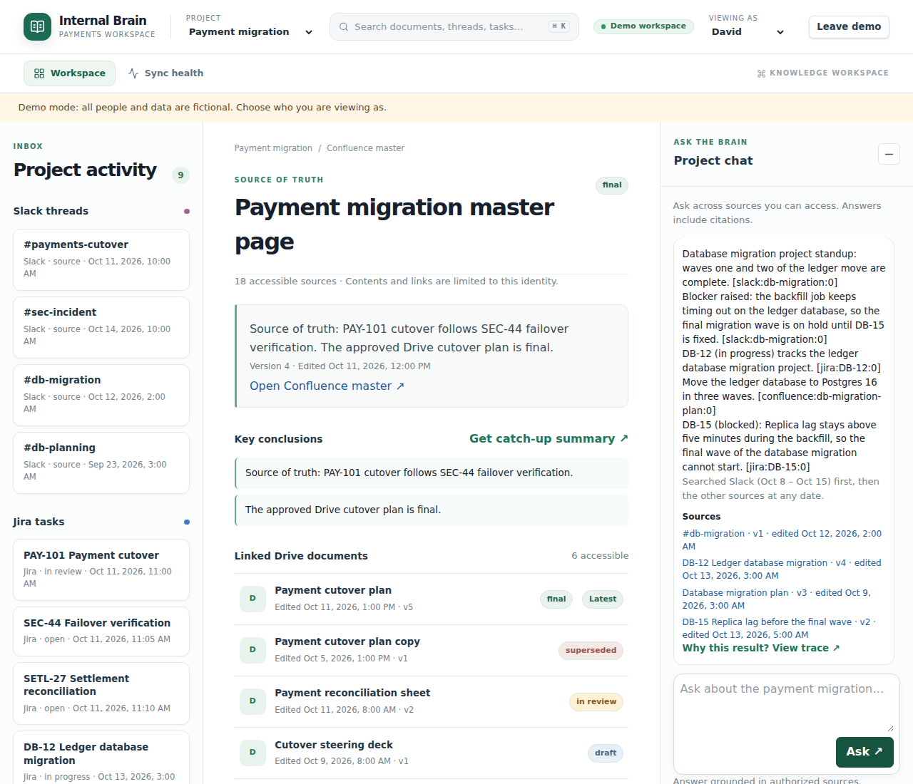
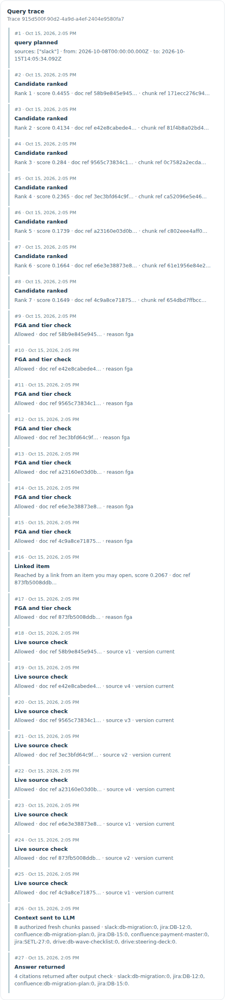
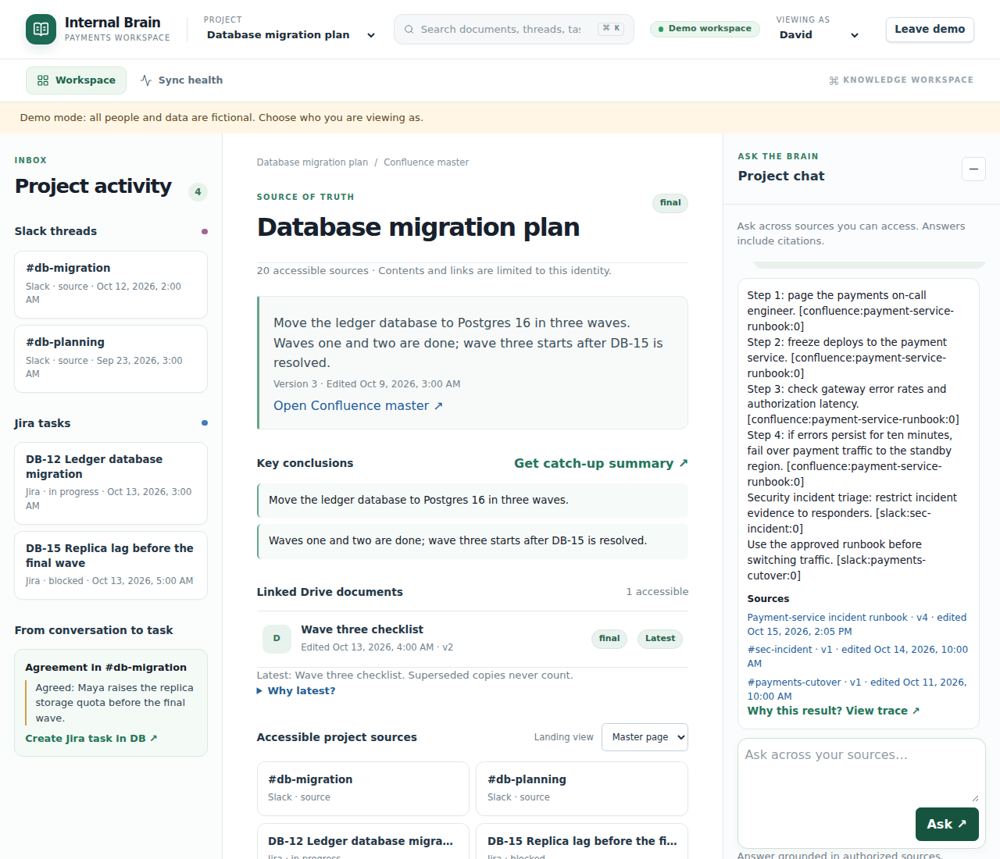
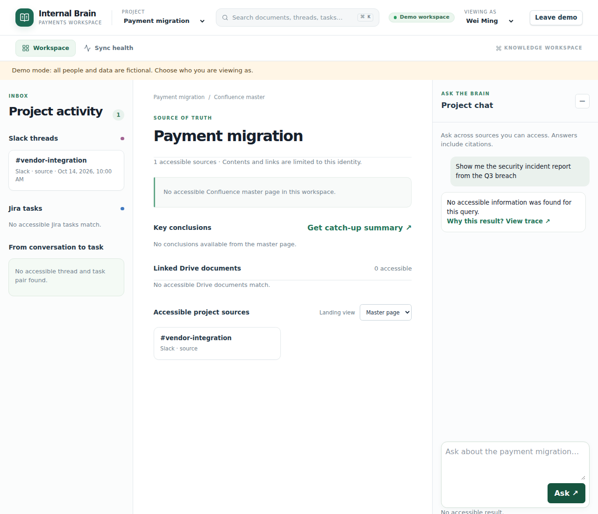
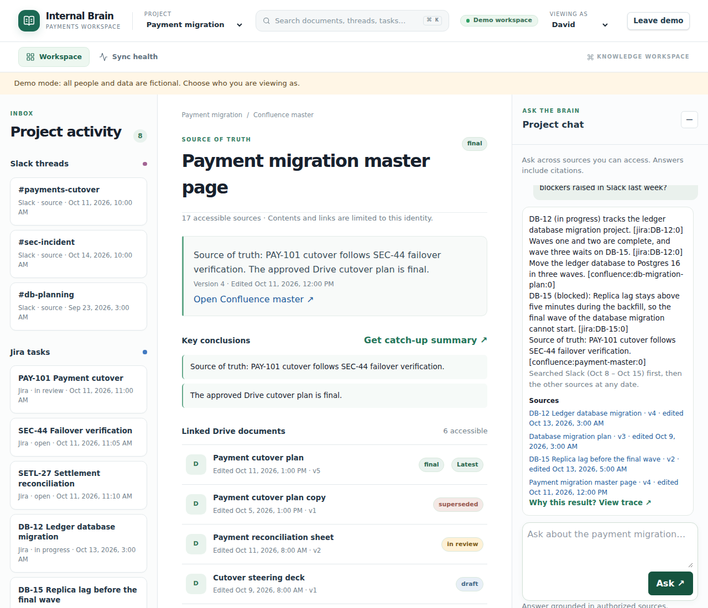
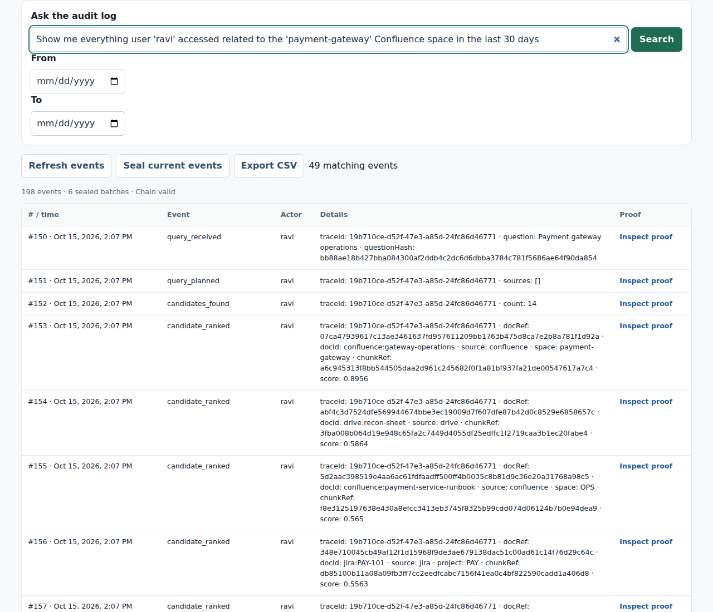
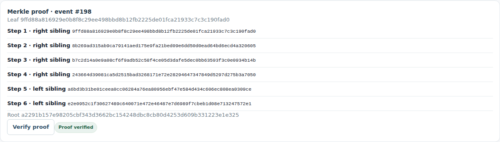

# Worked examples with a language model

The challenge brief's five scenarios, run end to end on the demo data with a language model. `pnpm scenarios:model` writes this file; `worked-examples.md` has the same steps with the built-in writer.

- **Date:** Thursday 15 October 2026, UTC. Demo content is dated relative to the clock, so "last week" finds it.
- **Writer:** Groq's `openai/gpt-oss-120b`, captured on 2026-10-03. Model answers vary from run to run, so the tests don't check this file. Where the model couldn't answer, the built-in writer did, as noted.
- **Search:** keywords, synonyms and freshness, plus semantic similarity from Cloudflare Workers AI's `@cf/baai/bge-m3` embeddings, at `SEMANTIC_MIN` 0.51.
- **People:** David is the engineer in the brief, Ravi heads payments, Maya is an admin, Nur works in compliance, Alex is an intern and Wei Ming is a contractor.
- **Decision tables** are the compliance view of the audit trail. Match is the search score, or the item whose link brought a document in. The person asking sees only their own trace, which never names what they couldn't see.

## Scenario 1: one question across platforms

**The brief.** An engineer asks "What's the status of the database migration project and were there any blockers raised in Slack last week?" The answer should combine Jira issues with Slack messages from channels the engineer belongs to, cite them, and leave out private channels the engineer isn't in.

### David asks

Read as: Slack first, and Slack only from 8 Oct 2026 to 15 Oct 2026; other platforms at any date.

> DB-12 (in progress) tracks the ledger database migration project. [jira:DB-12:0]
> Waves one and two are complete, and wave three waits on DB-15. [jira:DB-12:0]
> Database migration project standup: waves one and two of the ledger move are complete. [slack:db-migration:0]
> Blocker raised: the backfill job keeps timing out on the ledger database, so the final migration wave is on hold until DB-15 is fixed. [slack:db-migration:0]
> DB-15 (blocked): Replica lag stays above five minutes during the backfill, so the final wave of the database migration cannot start. [jira:DB-15:0]
> Waves one and two are done; wave three starts after DB-15 is resolved. [confluence:db-migration-plan:0]

| Cited | Title | Version | Last edited |
| --- | --- | --- | --- |
| `jira:DB-12` | DB-12 Ledger database migration | 4 | 13 Oct 2026, 03:00 UTC |
| `slack:db-migration` | #db-migration | 1 | 12 Oct 2026, 02:00 UTC |
| `jira:DB-15` | DB-15 Replica lag before the final wave | 2 | 13 Oct 2026, 05:00 UTC |
| `confluence:db-migration-plan` | Database migration plan | 3 | 9 Oct 2026, 03:00 UTC |

**How each document was decided:**

| Document | Match | Access check | Live check at the source | Sent to the writer | Rechecked after writing | Cited |
| --- | --- | --- | --- | --- | --- | --- |
| `slack:db-migration` | 0.68 | allowed | allowed, v1 | yes | allowed | yes |
| `slack:db-oncall` | 0.64 | **denied** | – | no | – | no |
| `jira:DB-12` | 0.58 | allowed | allowed, v4 | yes | allowed | yes |
| `confluence:db-migration-plan` | 0.50 | allowed | allowed, v3 | yes | allowed | yes |
| `jira:DB-15` | 0.48 | allowed | allowed, v2 | yes | allowed | yes |
| `jira:SETL-27` | 0.39 | allowed | – | no | – | no |
| `confluence:payment-master` | 0.39 | allowed | allowed, v4 | yes | allowed | no |
| `drive:steering-deck` | 0.36 | allowed | allowed, v1 | yes | allowed | no |
| `drive:db-wave-checklist` | link from `jira:DB-12` | allowed | allowed, v2 | yes | allowed | no |
| `drive:api-spec-copy` | link from `jira:SETL-27` | allowed | – | no | – | no |
| `drive:api-spec` | link from `confluence:payment-master` | allowed | – | no | – | no |
| `drive:cutover-plan` | link from `confluence:payment-master` | allowed | – | no | – | no |
| `drive:recon-sheet` | link from `confluence:payment-master` | allowed | – | no | – | no |
| `jira:PAY-101` | link from `confluence:payment-master` | allowed | – | no | – | no |
| `jira:SEC-44` | link from `confluence:payment-master` | allowed | – | no | – | no |
| `slack:payments-cutover` | link from `confluence:payment-master` | allowed | allowed, v1 | yes | allowed | no |

- `slack:db-oncall` is a private channel David isn't in. It was denied before anything reached the writer. David's own trace has 27 events and mentions it: no.
- `slack:db-planning`, three weeks old, is outside "last week". Asked without "last week", it reaches the writer: yes.

### Ravi asks the same question

Ravi is in #db-oncall, so his answer cites it: yes. It adds:

> On-call blocker raised overnight: the database migration hit lock timeouts on the settlements table. [slack:db-oncall:0]

## Scenario 2: fresh content

**The brief.** At 2:05 PM someone asks "What's the latest runbook for the payment-service incident?" The answer must include the failover step added to the Confluence runbook at 1:00 PM, and outdated content must never be served as current.

- **12:00** The Brain syncs. The runbook is version 3, with steps 1 to 3.
- **13:00** Step 4 is added in Confluence itself. No sync runs.
- **14:05** David asks.

> Step 1: page the payments on-call engineer. [confluence:payment-service-runbook:0]
> Step 2: freeze deploys to the payment service. [confluence:payment-service-runbook:0]
> Step 3: check gateway error rates and authorization latency. [confluence:payment-service-runbook:0]
> Step 4: if errors persist for ten minutes, fail over payment traffic to the standby region. [confluence:payment-service-runbook:0]

| Cited | Title | Version | Last edited |
| --- | --- | --- | --- |
| `confluence:payment-service-runbook` | Payment-service incident runbook | 4 | 15 Oct 2026, 13:00 UTC |

- Step 4 is in the answer: yes. The runbook is cited as version 4, edited 15 Oct 2026, 13:00 UTC.
- Before anything reaches the writer, the Brain checks each document's version and permissions at the source. It refreshed the runbook then: yes.
- The superseded 2025 copy, `drive:runbook-2025`, is cited: no.

## Scenario 3: no hint that restricted content exists

**The brief.** A contractor asks "Show me the security incident report from the Q3 breach", which lives in a security-only Confluence space. The reply must contain nothing from it, and must neither confirm nor deny that it exists.

| Who | Question | Reply |
| --- | --- | --- |
| Wei Ming, contractor | Show me the security incident report from the Q3 breach | No accessible information was found for this query. |
| Wei Ming | Show me the zebra onboarding notes from the Q9 offsite (a topic that doesn't exist) | No accessible information was found for this query. |
| Alex, intern | Show me the security incident report from the Q3 breach | No accessible information was found for this query. |

- Wei's two replies are identical: yes. So are his own traces: yes, with 1 event each, an empty answer.
- The compliance view shows what was refused for him: `confluence:q3-incident`, `slack:sec-incident`, `confluence:payment-service-runbook`, `jira:SEC-44`, `drive:runbook-2025`. Passages sent to the writer for him: none.
- Ravi, who may see payments material, asks "What does PAY-101 need before cutover?" and gets a cited answer from 3 platforms.

## Scenario 4: access changes apply to the next question

**The brief.** After a revocation, such as removal from a Slack channel or a restricted Confluence page, later answers must reflect it.

### Maya removes David from #db-migration

- **11:00** David asks the scenario 1 question. His answer cites `slack:db-migration`: yes.
- **11:05** Maya removes him from the channel. The audit records `channel_membership_removed`: yes.
- **11:06** David asks again. His answer cites the channel: no. It still cites Jira: `jira:DB-12`, `jira:DB-15`.

> DB-12 (in progress) tracks the ledger database migration project. [jira:DB-12:0]
> Waves one and two are complete, and wave three waits on DB-15. [jira:DB-12:0]
> DB-15 (blocked): Replica lag stays above five minutes during the backfill, so the final wave of the database migration cannot start. [jira:DB-15:0]

### Maya restricts the runbook page

- **11:10** David asks "What's the latest runbook for the payment-service incident?" His answer cites the runbook: yes.
- **11:15** Maya removes him from the page's viewers. The audit records `native_permission_changed`: yes.
- **11:16** David asks again. His answer cites the runbook: no. His own trace mentions it: no. His answer now reads:

> Payment cutover discussion: PAY-101 depends on the SEC-44 failover drill. [slack:payments-cutover:0]
> Use the approved runbook before switching traffic. [slack:payments-cutover:0]
> Security incident triage: restrict incident evidence to responders. [slack:sec-incident:0]
> Source of truth: PAY-101 cutover follows SEC-44 failover verification. [confluence:payment-master:0]
> PAY-101 (in review) tracks the payment cutover. [jira:PAY-101:0]

*Written by the built-in writer instead of the model (rate_limited).*

- Ravi asks the same question. His answer cites the runbook: yes.

## Scenario 5: the audit trail answers compliance questions

**The brief.** Compliance can reconstruct what any user asked, what was retrieved for them and what was answered, with times and authorization decisions. The example is "Show me everything user 'jdoe' accessed related to the 'payment-gateway' Confluence space in the last 30 days". Here Ravi stands in for 'jdoe'.

Earlier that day, Ravi asks "Payment gateway operations" at 09:30 and "PAY-101 cutover" at 09:40, and Alex asks "Executive milestones staged cutover decisions" at 09:50.

### Nur searches the audit trail at 16:00

> Show me everything user 'ravi' accessed related to the 'payment-gateway' Confluence space in the last 30 days

Read as: user `ravi`, source `confluence`, space `payment-gateway`, from 15 Sep 2026, 00:00 UTC to 15 Oct 2026, 16:00 UTC. It finds 51 entries, grouped here by question; the workspace's Compliance tab lists each one.

| Entries | Time | Question | Documents checked | Refused | Sent to the writer | Answer |
| --- | --- | --- | --- | --- | --- | --- |
| 35–85 | 09:30 | "Payment gateway operations" | 15 | `confluence:q3-incident` | 8 documents | "Payment gateway operations: inspect authorization latency and settlement health each mo…" |

- From the `payment-gateway` space, `confluence:gateway-operations`. Access check: allowed; live check at the source: allowed, v1; sent to the writer: yes; rechecked after writing: allowed.

### Who retrieved a document

> Who retrieved the Payment gateway operations page?

Read as: document `confluence:gateway-operations`. Retrieved for: Ravi.

### Tamper evidence

- Every entry carries the hash of the one before it. The chain verifies: yes.
- Nur seals the log into a Merkle batch of entries 1 to 157. The proof for Ravi's answer, entry 85, verifies against it: yes.
- A copy of the log with that answer changed is refused ("Invalid stored audit log").
- A copy with entry 79 deleted is refused ("Invalid stored audit log").

